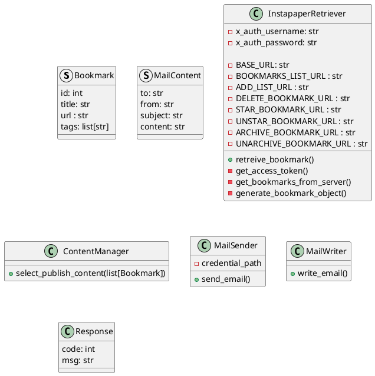
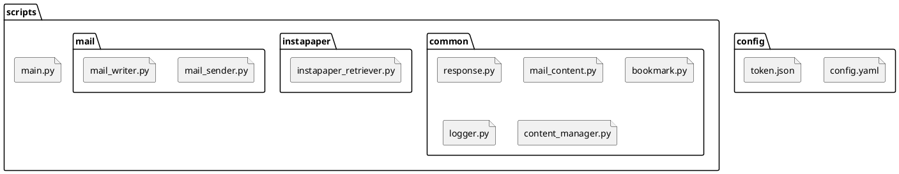
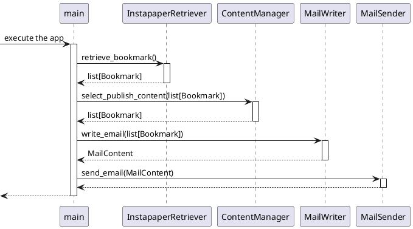

# bookmark_notification

bookmarkしたリンクをランダムに選んで、ユーザにメールで通知する。
cron等のサービスで定期実行できるようにして、過去のブックマークの内容を定期的にユーザに思い出させることを目的とする。

## Requirements

- サービスの互換性
  - Instapaperでも、他のサービスでも実行可能にする
  - gmail APIでも、他のメーラーでも実行可能にする
- 機能拡張性
  - 内容をAIによって処理させる余地を残す

## Design

- アプリケーションのエントリポイント
- Instapaperからbookmarkを取得する機能
- 取得したbookmarkからユーザに送信するものを選ぶ機能
- メールを送信する機能

- configurationはyamlファイルで行う
- loggingは、loggingモジュールで行う

## 準備

- Google CloudのOAuthの準備
- Instapaper APIの準備
- cronの準備

## その他

- 各技術要素の実装のプロトタイプが`prototype/`ディレクトリにある
